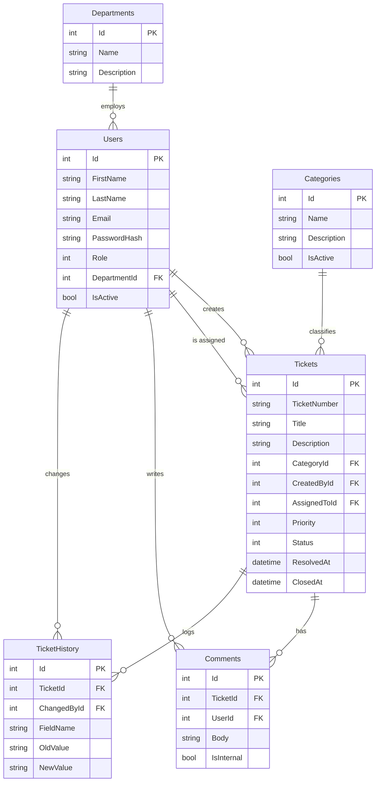

# Database Schema (ER Diagram)

## Indexes

| Table          | Index                         | Type    |
|----------------|-------------------------------|---------|
| Users          | Email                         | Unique  |
| Users          | Role                          | Normal  |
| Categories     | Name                          | Unique  |
| Departments    | Name                          | Unique  |
| Tickets        | TicketNumber                  | Unique  |
| Tickets        | Status, Priority, AssignedToId, CreatedById | Normal |
| Tickets        | (Status, CreatedAt) composite | Normal  |
